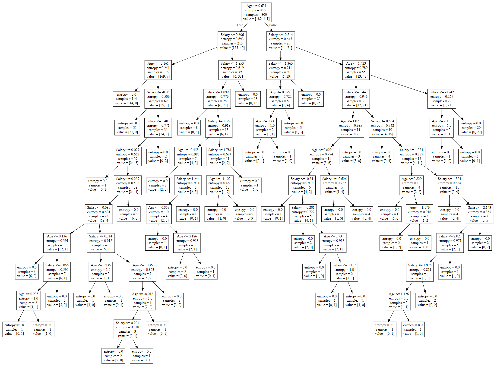
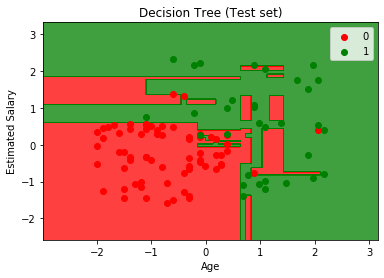

Decision Tree Classification
===================================

*Decision Tree creates classifies the data in a tree structure. It splits a data set into smaller subsets by decreasing the entropy(randomness) in data sets and hence estimates the result."*

 

  

 The decision tree built by the the model.

 

  

Here the scatter points represent the outcome of the given set by there color(Red and Green) and the colored region in the graph  represents the classifier prediction.

If the color of the point matches with the color of the region then the prediction made by the classifier is correct.
