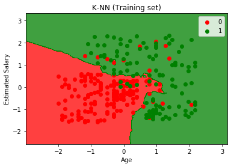

K-Nearest Neighbours
===================================

*K-Nearest Neighbours is a classification algorithm which stores all the available data and classifies a new data point based on the similarity with the given training set. It selects K number of points having the least distance from the given new data point and count the number of data points in each category. The category having maximum nummber of point is assigned to the given new data point."*

   

Here the scatter points represent the outcome of the given set by there color(Red and Green) and the colored region in the graph  represents the classifier prediction.

If the color of the point matches with the color of the region then the prediction made by the classifier is correct.
