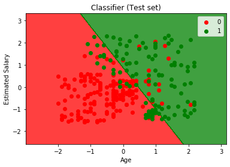
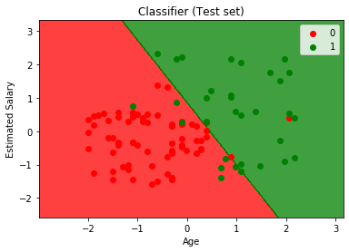

Logistic Regression
===================================

*Logistic Regression is a classification algorithm which predicts the output of a categorical dependent variable i.e. the result must be a categorical or discrete value like 0 or 1, True or False etc."*

   

Here the scatter points represent the outcome of the given set by there color(Red and Green) and the colored region in the graph seperated by logistic regression boundary represents the classifier prediction based on the given set.

If the color of the point matches with the color of the region then the prediction made by the classifier is correct.
