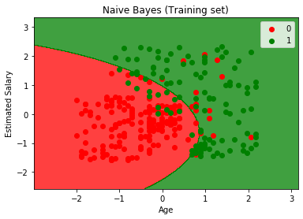
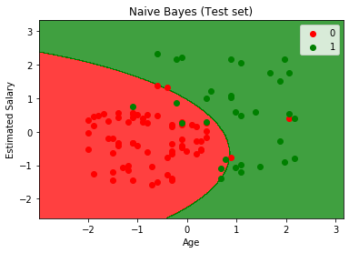

Naive Bayes
===================================

*Naive Bayes is a supervised machine learning algorithm which is based on Bayes theorem and is used for classification problems. It is a probabilistic classifier, which means it predicts the outcomes based on the probability of an object.*

## 
Bayes theorem - <samp>P(A|B) = P(B|A).P(A)/P(B)</samp>

   

Here the scatter points represent the outcome of the given set by there color(Red and Green) and the colored region in the graph  represents the classifier prediction.

If the color of the point matches with the color of the region then the prediction made by the classifier is correct.
