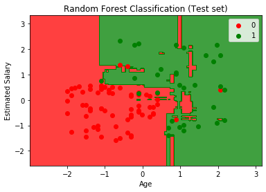

Random Forest Classification
===================================

*A random forest is an ensemble(group of items viewed as a whole) techinque capable of performing regression and classification tasks by combinig multiple deccision trees in determining the result rather than relying on individual decision tree."*

   

Here the scatter points represent the outcome of the given set by there color(Red and Green) and the colored region in the graph  represents the classifier prediction.

If the color of the point matches with the color of the region then the prediction made by the classifier is correct.

