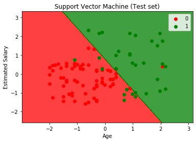

Support Vector Machine (SVM) - Linear Kernel
===================================

*Support Vector Machine is a supervised machine learning model which uses classification algorithm for two group classification. The goal of SVM is to create the a decision boundary that can seperate the n-dimensional space into classes so that the new data point ca easily placed in the right category. The decision boundary is called hyperplane. SVM chooses the extreme points/vectors that help in creating hyperplane. These points are called support vectors and hence the model is called Support Vector Machine.*

   

Here the scatter points represent the outcome of the given set by there color(Red and Green) and the colored region in the graph  represents the classifier prediction.

If the color of the point matches with the color of the region then the prediction made by the classifier is correct.
