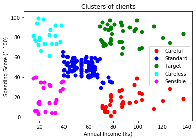
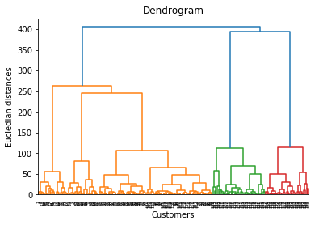

Hierarchical Clustering
===================================

*Hierarchical Clustering is an unsupervised learning algorithm used to solve clustering problem. It groups unlabeled dataset into different clusters. In this algorithm, we develop the hierarchy of cluster in the form of a tree, and this tree shaped structure is called Dendrogram.*

The hierarchical clustering technique has two approaches:
* [Agglomerative](https://www.javatpoint.com/hierarchical-clustering-in-machine-learning) - Bottom-Up approach
* [Divisive](https://www.javatpoint.com/hierarchical-clustering-in-machine-learning) - Top-Down approach

  

Below is the dendrogram of the above dataset.  

  

