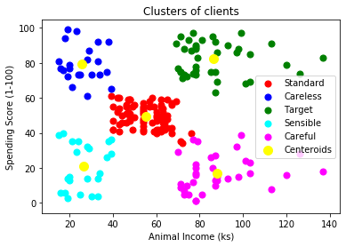
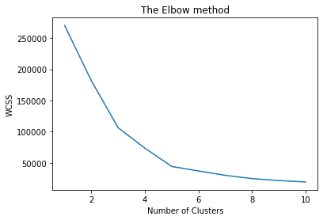

K-Means Clustering
===================================

*K-Means Clustering is an unsupervised learning algorithm used to solve clustering problem. It groups unlabeled dataset into different clusters. Here the K in the name means the number of clusters that need to be created in the process.*

  

The vslue of K (number of clusters) is decided through the elbow of the Number of clusters v/s [WCSS (Within Cluster Sum of Square)](https://www.javatpoint.com/k-means-clustering-algorithm-in-machine-learning#:~:text=In%20the%20above%20formula%20of,for%20the%20other%20two%20terms.) graph.

  

