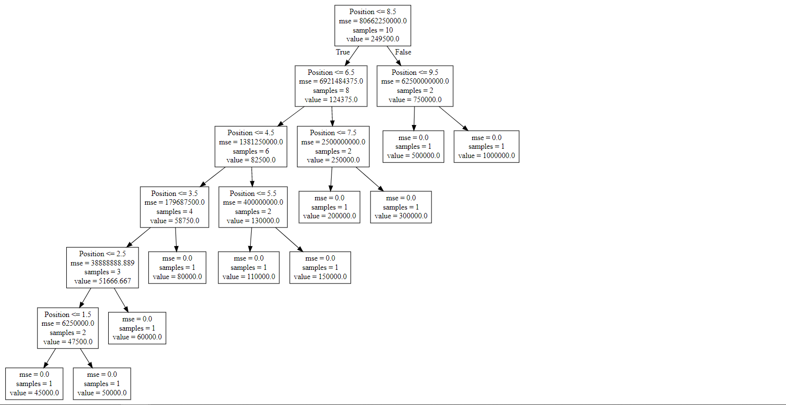

Decision Tree Regression
===================================

*A Decision Tree creates regression models as a tree structure. It splits a data set into smaller subsets by decreasing the entropy(randomness) in data sets and hence estimates the result."*

  

Here the blue line is the Decision Tree ML model 

  

 The decision tree built by the the model.
