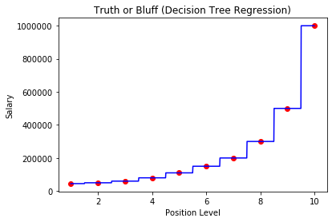
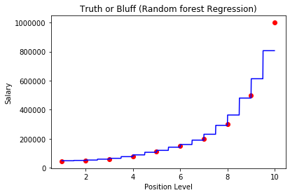

Random Forest Regression
===================================

*A random forest is an ensemble(group of items viewed as a whole) techinque capable of performing regression and classification tasks by combinig multiple deccision trees in determining the result rather than relying on individual decision tree."*

   

Here the blue line(in Random Forest Regression) is the ML model built by combining multiple decision tree.

