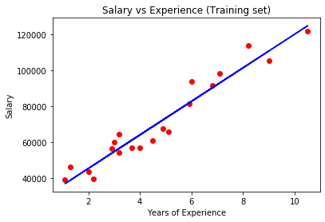

Simple Linear Regression
===================================

*A Simple Linear Regression estimates the relationship between the two variable.*

## <center><samp>y = mx + c</samp></center>

```Eg. Here salary of an employee can be consider as an```
<div align="center">  </div>

* <samp>y = mx + c</samp> `(Blue Line - Represents Simple Linear ML model)`
* <samp>y</samp> = dependent variable `(Salary)`
* <samp>m</samp> = slope constant `(Variation of Salary with increase in experience)`
* <samp>x</samp> = independent variable `(Experience)`
* <samp>c</samp> = constant `(Even if the employee is a freshee there is some salary that the company has to offer to him/her)`