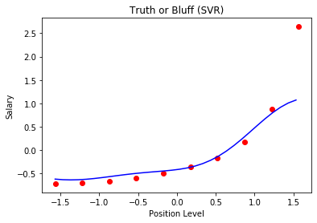

Support Vector Regression
===================================

*A Support vector regression (SVR) is an extension of SVM in which instead of trying to minimizing the error rate as done in simple regression, try to fit the error within a certain threshold."*

    

* `Here the blue line in SVR is the hyper plane(Since support vector is used more of as a classification algorithm.)`
